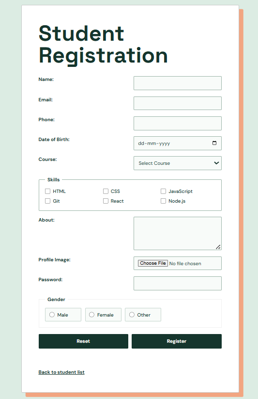
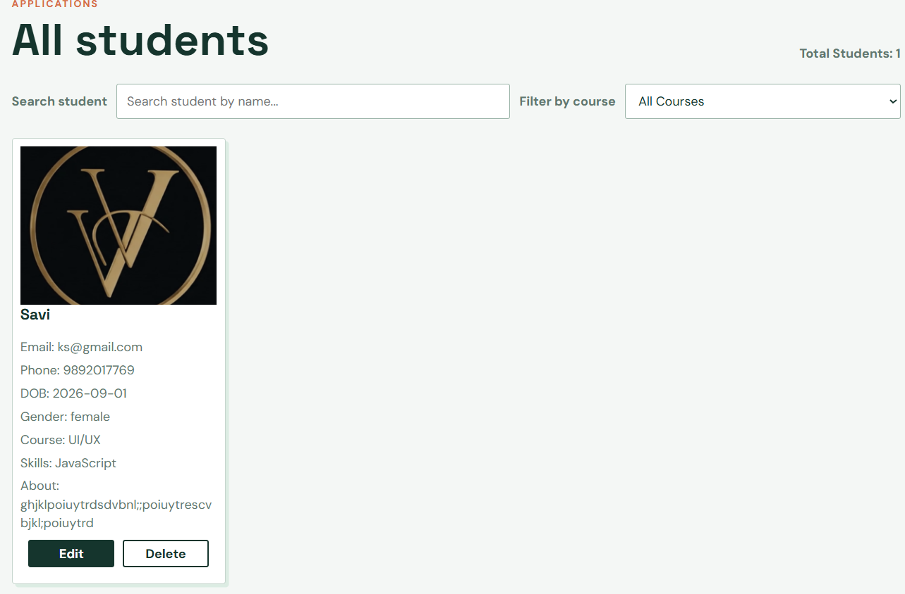
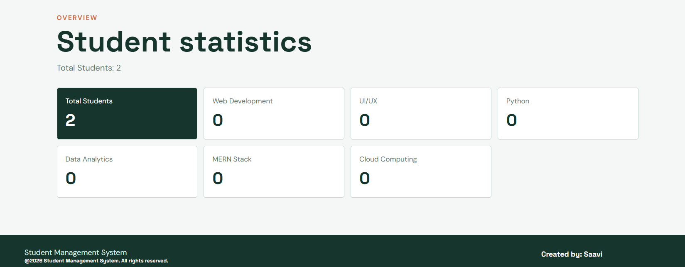

# Project Screenshots

## Landing Page

The landing page introduces the Student Management System and provides Register and Login navigation.

## Registration Page

The registration page collects student details including contact information, course, skills, gender, about text, password, and profile image.

## Student Dashboard

The dashboard displays registered students as cards with their details and management actions.

## Project Description

This screenshot represents the project description and overview.
